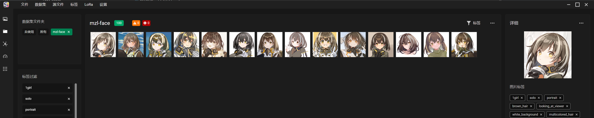
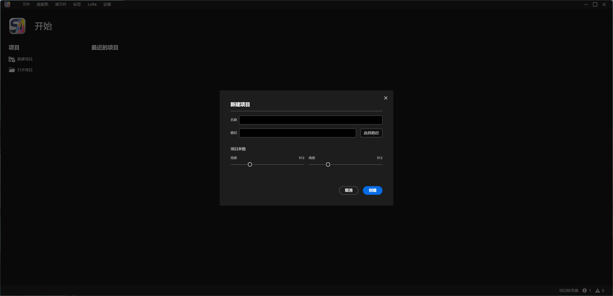
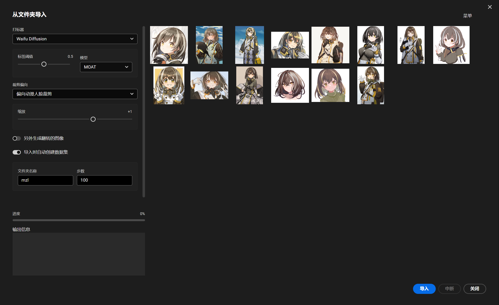
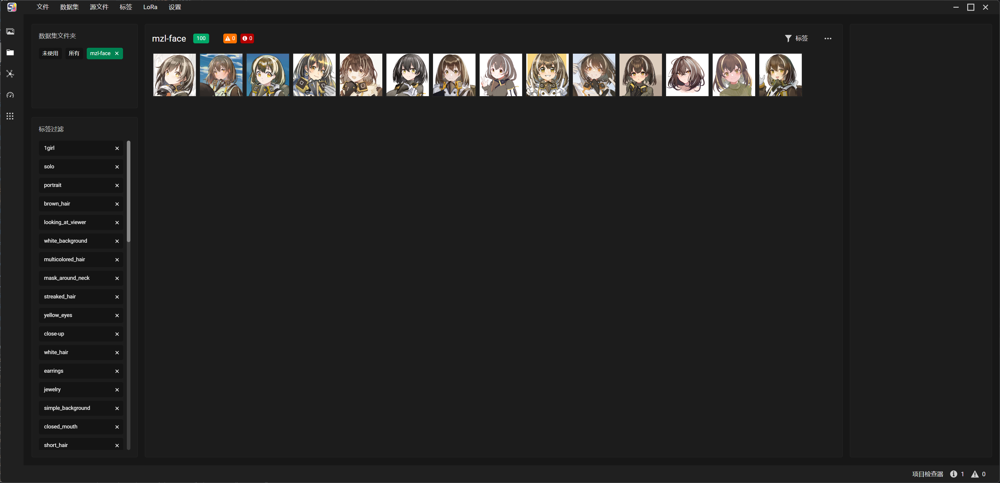
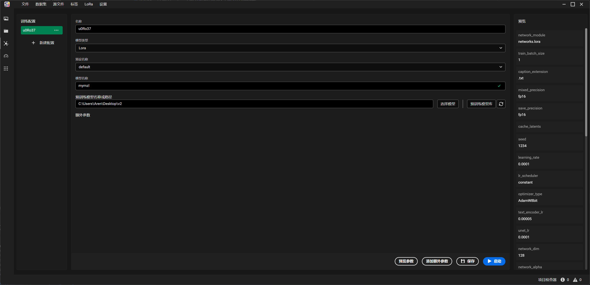
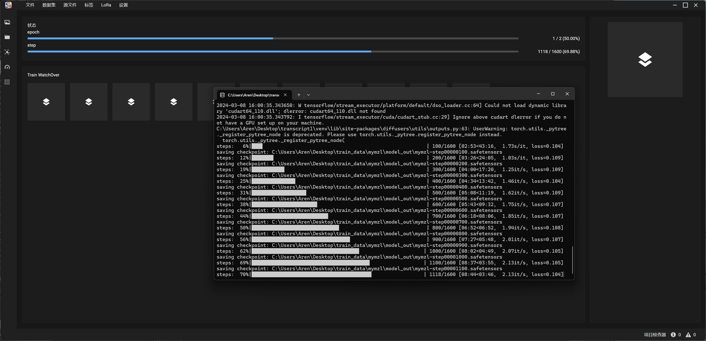
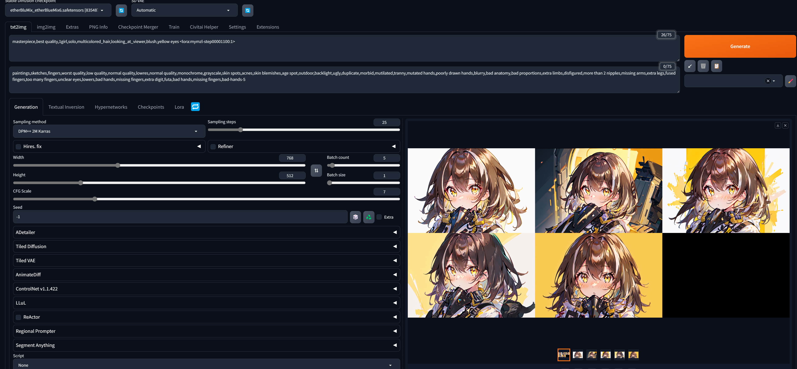
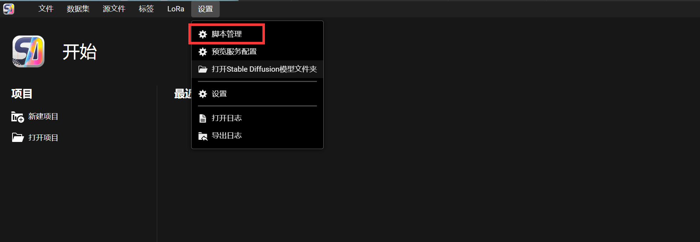
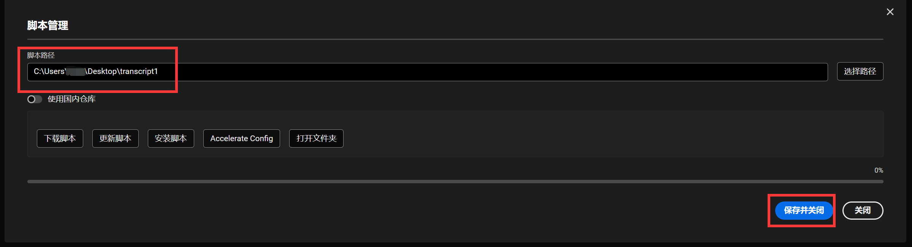

# Lora forge

Lora 训练工具，目标是将所有的处理工作放在一起，提供易于操作的界面。

应用采用分离式设计，脚本的GUI是分开的，可以很轻松地和其他地训练脚本进行兼容。
## 需求
使用前先将相关的训练脚本下载后安装好

### 下载相关的脚本 

`git clone https://github.com/AllenTom/lora_train_core.git`

### 安装需求

在下载的目录下，执行脚本，依赖比较多，安装时间比较久。遇到网络问题请自行使用代理。

`.\setup.bat`

## 快速的训练脚本
快速训练是应用开发的宗旨，尽可能少的步骤中训练出lora模型

### 创建项目
菜单`文件`→`新建项目`

### 创建数据集
菜单`源文件`→`自动导入`

右上角菜单点击后导入图片

选择合适的打标器，配置打标阈值。这里设置了人物脸部聚焦，减少因为裁剪时的因为裁剪位置错误造成想要的部分没有被裁剪到。

设置数据集名称和步数。

点击导入

导入完成后，可以看到对于垂直尺寸较长的图片也会以脸部为中心进行裁剪。

### 配置训练参数
左侧，切换到训练配置界面

只需要给模型命名，其他的参数已经默认给好。如果要覆盖，点击`添加额外参数`

## 训练
启动训练

### 结果
将模型导入SDW，查看生成情况

### 设置脚本路径
在菜单中进入脚本配置的界面

选好路径之后别忘记保存

## 预览
数据集编辑

裁剪图片

自动导入并打标

配置训练参数

